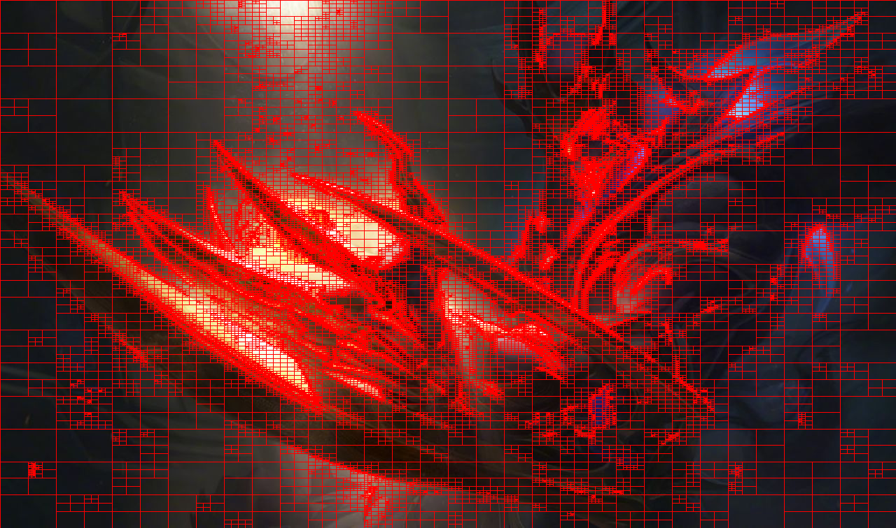

# Region QuadTree para compresión
El repositorio incluye la estructura de datos de Region QuadTree 
implementada en Rust para comprimir imágenes.

# Pruebas
Se probó con dos imágenes, las que están en la carpeta `test, los 
resultados son presentados a continuación

## Prueba 1

**Imagen original:**


**Imagen con rectángulos**


## Prueba 2

**Imagen original:**


**Imagen con rectángulos**


# Reproducción
Para probar el código se necesita tener Rust 1.39, y para ejecutar el programa se debe ejecutar el siguiente comando:

```
$ cargo run -- <imagen> <salida> <presicion>
```